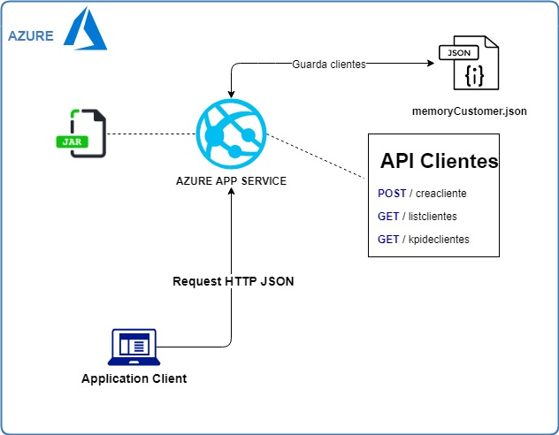
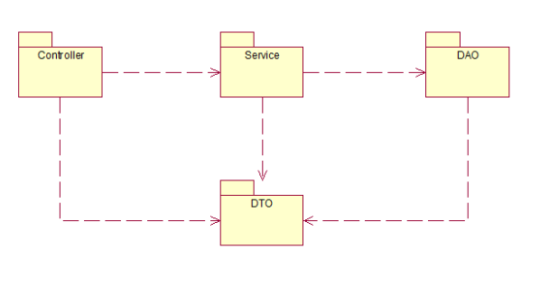

# Intercorp Retail

----
## Descripción

> Microservicio hecho en java 8 y SpringBoot , desplegado en Azure(Web app).

----
## API 
1. POST - crearcliente (crea un nuevo cliente)
2. GET - kpideclientes (obtiene edad promedio y desviación estandar)
3. GET - listclientes (obtiene todos los clientes agregandole la fecha probable de su muerte)

----
## Arquitectura

## Vista Logica

----
## Gracias
* [Christopher Ocares Hermosa](https://www.linkedin.com/in/christopher-boris-ocares-hermosa-73b38813b/)
